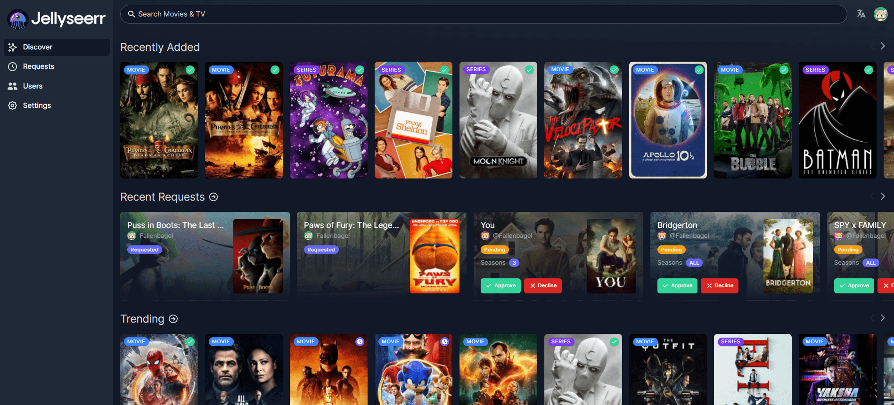

<!--
Este archivo README esta generado automaticamente<https://github.com/YunoHost/apps/tree/master/tools/readme_generator>
No se debe editar a mano.
-->

# Jellyseerr para Yunohost

[](https://ci-apps.yunohost.org/ci/apps/jellyseerr/)


[](https://install-app.yunohost.org/?app=jellyseerr)

*[Leer este README en otros idiomas.](./ALL_README.md)*

> *Este paquete le permite instalarJellyseerr rapidamente y simplement en un servidor YunoHost.*  
> *Si no tiene YunoHost, visita [the guide](https://yunohost.org/install) para aprender como instalarla.*

## Descripción general

Jellyseerr is a free and open source software application for managing requests for your media library. It is a a fork of Overseerr built to bring support for Jellyfin & Emby media servers!

**Versión actual:** 2.2.2~ynh2

## Capturas



## Documentaciones y recursos

- Repositorio del código fuente oficial de la aplicación : <https://github.com/Fallenbagel/jellyseerr>
- Catálogo YunoHost: <https://apps.yunohost.org/app/jellyseerr>
- Reportar un error: <https://github.com/YunoHost-Apps/jellyseerr_ynh/issues>

## Información para desarrolladores

Por favor enviar sus correcciones a la [rama `testing`](https://github.com/YunoHost-Apps/jellyseerr_ynh/tree/testing).

Para probar la rama `testing`, sigue asÍ:

```bash
sudo yunohost app install https://github.com/YunoHost-Apps/jellyseerr_ynh/tree/testing --debug
o
sudo yunohost app upgrade jellyseerr -u https://github.com/YunoHost-Apps/jellyseerr_ynh/tree/testing --debug
```

**Mas informaciones sobre el empaquetado de aplicaciones:** <https://yunohost.org/packaging_apps>
